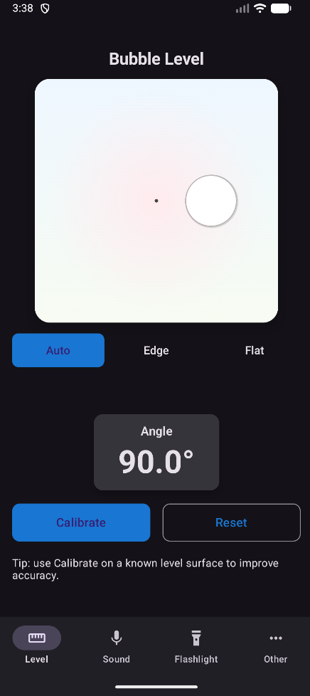
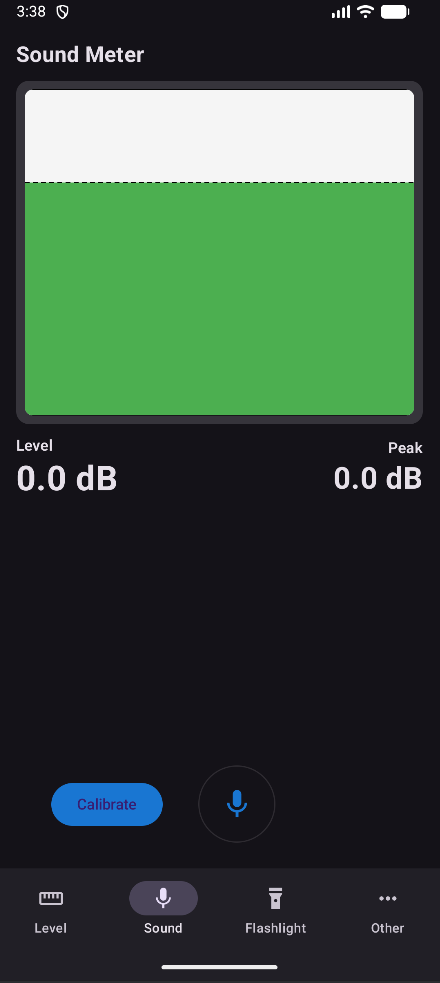
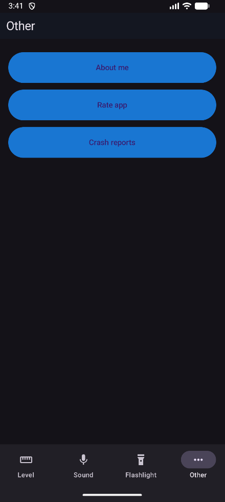
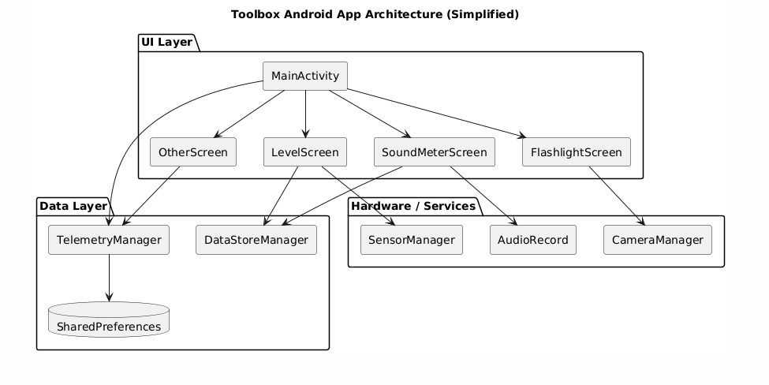

# Toolbox 
## 📱 Описание
Пприложение для Android, объединяющее несколько инструментов в одном интерфейсе.

## 🔧 Основные инструменты
- **Уровень**: Пузырьковый уровень с режимами *Edge/Flat* и калибровкой.
- **Шумомер**: Измерение уровня звука в дБ с графической визуализацией.
- **Фонарик**: Несколько режимов (постоянный, SOS, стробоскоп, свеча).
- **Статистика**: Просмотр данных использования и оценка приложения.

  
  
  
  

## 📈 Соответствие критериям оценивания

### 1. Модель качества и чек-лист
- **Архитектурная диаграмма**: 

### 2. Структурированное тестирование
- **Модель тестирования**: Включает юнит-тесты для бизнес-логики

### 3. Количественные метрики
**Ключевые метрики:**
- Количество запусков
- Время использования
- Длительность сессий
- Время на каждой вкладке
- Оценки пользователей
**Инструмент мониторинга**: Встроенная система телеметрии  

### 4. Сбор обратной связи
**Механизм обратной связи:**
- Периодические запросы оценки (каждые 5 запусков)
- Кнопка оценки в разделе "Other"

### 5. Продуктивность
- **Состояние приложения**: ✅ Установлено и работает на Android устройстве
